```mermaid
graph TB
    Start([Inicio de Aplicación]) --> LoadEnv[Cargar variables .env]
    LoadEnv --> ElectronInit[Inicializar Electron]
    
    ElectronInit --> MainProcess[["Proceso Principal<br/>(main.js)"]]
    ElectronInit --> PreloadBridge[["Preload Bridge<br/>(preload.js)"]]
    ElectronInit --> RendererUI[["UI Renderer<br/>(renderer.js)"]]
    
    MainProcess --> CreateWindow[Crear Ventana Principal]
    CreateWindow --> LoadUI[Cargar Interfaz HTML]
    
    LoadUI --> UserActions{Acción del Usuario}
    
    UserActions -->|Login WhatsApp| InitWhatsApp[Inicializar WhatsApp Web]
    InitWhatsApp --> ShowQR[Mostrar código QR]
    ShowQR --> ScanQR[Usuario escanea QR]
    ScanQR --> WhatsAppReady[WhatsApp Listo]
    
    UserActions -->|Seleccionar Carpeta| ChooseFolder[Elegir carpeta capturas]
    ChooseFolder --> SavePath[Guardar ruta en CAPTURE_DIR]
    
    UserActions -->|Ejecutar Ahora| RunOnce[Ejecutar escenario único]
    UserActions -->|Programar 30min| Schedule30[Iniciar programación]
    UserActions -->|Detener| StopSchedule[Detener programación]
    
    Schedule30 --> AlignTime[Alinear a HH:00 o HH:30]
    AlignTime --> SetInterval[Configurar intervalo 30 min]
    SetInterval --> RunScenario
    
    RunOnce --> RunScenario[Ejecutar Escenario Bot]
    
    RunScenario --> BotProcess[["Proceso Bot<br/>(bot.js)"]]
    
    BotProcess --> CheckHeadless{Modo Headless?}
    CheckHeadless -->|Sí| LaunchHeadless[Lanzar Puppeteer sin UI]
    CheckHeadless -->|No| LaunchWithUI[Lanzar Puppeteer con UI]
    
    LaunchHeadless --> NavigateWhatsApp
    LaunchWithUI --> NavigateWhatsApp[Navegar a WhatsApp Web]
    
    NavigateWhatsApp --> LoadChats[Cargar CHAT_IDS]
    LoadChats --> ProcessChat[Procesar cada chat]
    
    ProcessChat --> OpenChat[Abrir conversación]
    OpenChat --> SendMessage[Enviar mensaje cotización]
    SendMessage --> WaitResponse[Esperar respuesta 30s]
    
    WaitResponse --> CheckSticker{¿Recibió Sticker?}
    CheckSticker -->|No| ErrorNoSticker[Error: Sin sticker inicial]
    CheckSticker -->|Sí| ContinueFlow
    
    ContinueFlow --> WaitImage[Esperar imagen final 30s]
    WaitImage --> CheckImage{¿Recibió Imagen?}
    CheckImage -->|No| ErrorNoImage[Error: Sin imagen final]
    CheckImage -->|Sí| CaptureScreen
    
    CaptureScreen[Capturar pantalla] --> AddTimestamp[Agregar fecha/hora]
    AddTimestamp --> SaveCapture[Guardar en CAPTURE_DIR]
    SaveCapture --> SuccessNotify[Notificar éxito en UI]
    
    ErrorNoSticker --> SendAlert
    ErrorNoImage --> SendAlert[Enviar alerta WhatsApp]
    SendAlert --> NavigateAlert[Ir a ALERT_CHAT_ID]
    NavigateAlert --> SendError[Enviar mensaje de error]
    SendError --> ShowErrorUI[Mostrar error en UI]
    
    SuccessNotify --> CheckMoreChats{¿Más chats?}
    ShowErrorUI --> CheckMoreChats
    CheckMoreChats -->|Sí| ProcessChat
    CheckMoreChats -->|No| CloseBrowser[Cerrar navegador]
    
    CloseBrowser --> CheckScheduled{¿Está programado?}
    CheckScheduled -->|Sí| WaitNext30[Esperar próximos 30 min]
    CheckScheduled -->|No| End([Fin])
    
    WaitNext30 --> RunScenario
    
    StopSchedule --> ClearInterval[Limpiar intervalo]
    ClearInterval --> End
    
    style MainProcess fill:#f9f,stroke:#333,stroke-width:4px
    style BotProcess fill:#9ff,stroke:#333,stroke-width:4px
    style RendererUI fill:#ff9,stroke:#333,stroke-width:4px
    style PreloadBridge fill:#9f9,stroke:#333,stroke-width:4px
    style SendAlert fill:#f99,stroke:#333,stroke-width:2px
    style ErrorNoSticker fill:#faa,stroke:#333,stroke-width:2px
    style ErrorNoImage fill:#faa,stroke:#333,stroke-width:2px
```

<h1 align="center">
  <br>
  <a href="http://www.dcs.ar"></a>
  <br>
  Letizia Check – Monitor Sintético de WhatsApp
  <br>
</h1>

<h4 align="center">Sistema de monitoreo automatizado para flujos de cotización en WhatsApp Web con captura de evidencia y alertas.</h4>

<p align="center">
  <a href="#caracteristicas">Características</a> •
  <a href="#estructura">Estructura</a> •
  <a href="#instalacion">Instalación</a> •
  <a href="#uso">Uso</a> •
  <a href="#diagrama">Diagrama de Flujo</a> •
  <a href="#creditos">Créditos</a>
</p>

---

## <a name="caracteristicas"></a>Características

* **Login embebido de WhatsApp** con código QR integrado en la aplicación
* **Ejecución manual o programada** cada 30 minutos (alineada a HH:00 y HH:30)
* **Captura automática de pantalla** con timestamp superpuesto
* **Verificación de flujo completo**: detección de sticker inicial e imagen final
* **Sistema de alertas automáticas** vía WhatsApp cuando falla el proceso
* **Modo headless** para ejecución sin interfaz gráfica del navegador
* **Interfaz de usuario intuitiva** con controles de ejecución y configuración
* **Logs detallados** y notificaciones en tiempo real

---

## <a name="estructura"></a>Estructura del Proyecto

```
letizia-check/
├── src/
│   ├── main/
│   │   ├── main.js               # Proceso principal de Electron
│   │   └── handlers.js           # Manejadores de eventos IPC
│   ├── preload/
│   │   └── preload.js            # Bridge seguro entre procesos
│   ├── renderer/
│   │   ├── index.html            # Interfaz de usuario
│   │   ├── renderer.js           # Lógica del frontend
│   │   └── styles.css            # Estilos de la aplicación
│   └── bot/
│       ├── bot.js                # Lógica principal del bot
│       ├── whatsapp.js           # Integración con WhatsApp Web
│       └── capture.js            # Utilidades de captura
├── .env.example                  # Plantilla de configuración
├── package.json                  # Dependencias y scripts npm
└── README.md                     # Documentación principal
```

---

## <a name="instalacion"></a>Instalación

### Requisitos previos

- Node.js 18+
- npm
- Git
- Windows (probado), macOS y Linux (pueden requerir ajustes)
- Conexión a Internet para WhatsApp Web

### Clonar el repositorio

```bash
git clone https://github.com/DCSolutions-SRL/letizia-check.git
cd letizia-check
```

### Instalar dependencias

```bash
npm install
```

### Configurar variables de entorno

```bash
# Copiar archivo de ejemplo
cp .env.example .env

# Editar .env con tus configuraciones:
```

Configuraciones en `.env`:
```env
ALERT_CHAT_ID=5491123456789              # Chat para alertas cuando falla
CHAT_IDS=Letizia-Cotizador,Bot-Cotizaciones  # Chats del bot (separados por coma)
CAPTURE_DIR=C:/Users/Usuario/Documents/Capturas  # Carpeta para capturas (opcional)
HEADLESS_MODE=false                      # Modo headless por defecto
RESPONSE_TIMEOUT=30000                   # Timeout en milisegundos
```

---

## <a name="uso"></a>Uso

### Modo desarrollo

```bash
npm run dev
```

### Construir aplicación

```bash
# Para Windows
npm run build:win

# Para macOS
npm run build:mac

# Para Linux
npm run build:linux
```

### Controles de la interfaz

1. **Checkbox "Headless"**: Activa/desactiva el modo sin interfaz del navegador
2. **"Iniciar sesión WhatsApp"**: Muestra código QR para autenticación
3. **"Seleccionar carpeta de capturas"**: Elige destino para screenshots
4. **"Ejecutar ahora"**: Ejecuta el escenario una sola vez
5. **"Iniciar programación 30m"**: Activa ejecución automática cada 30 minutos
6. **"Detener programación"**: Detiene las ejecuciones programadas

### Flujo de operación

1. **Iniciar sesión en WhatsApp** escaneando el código QR
2. **Seleccionar carpeta** donde se guardarán las capturas
3. **Elegir modo de ejecución**:
   - Manual: "Ejecutar ahora" para prueba única
   - Automático: "Iniciar programación 30m" para monitoreo continuo
4. **Monitorear resultados** en la interfaz y revisar capturas guardadas

---

## <a name="diagrama"></a>Diagrama de Flujo



---

## <a name="creditos"></a>Créditos

* [DCSolutions SRL](https://www.dcs.ar)

---

<p align="center">
  © 2025 DCSolutions - Desarrollado para monitoreo sintético y automatización de procesos en WhatsApp Web.
</p>
